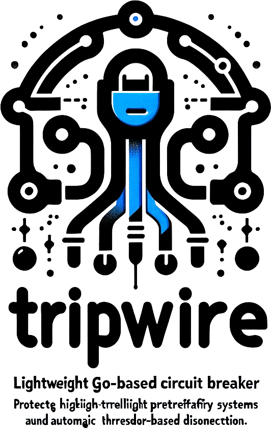
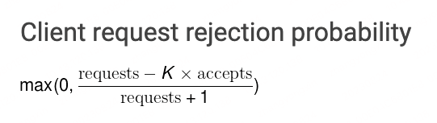

<div align="center">
    <h1>tripwire</h1>
    <p>A lightweight Go-based circuit breaker designed to protect high-traffic systems by intelligently preempting failures and ensuring stability through automatic threshold-based disconnections.</p>
	
</div>

# What is Circuit Breaker?

In a distributed system, a single service failure can lead to a cascade of failures, causing the entire system to fail. Circuit breakers are designed to prevent this from happening by preemptively disconnecting services that are likely to fail. This allows the system to remain stable and continue to function even when individual services are failing.

# What is tripwire?

`tripwire` is a lightweight Go-based circuit breaker designed to protect high-traffic systems by intelligently preempting failures and ensuring stability through automatic threshold-based disconnections. It aims to be simple, easy to use, and highly configurable, making it effortless for developers to integrate into their existing systems.

# Why tripwire?

While there are already many circuit breaker projects available on GitHub, `tripwire` stands out by providing a powerful yet user-friendly circuit breaker solution. Inspired by Google's circuit breaker designs, `tripwire` offers a robust circuit breaker that is easy to comprehend and seamlessly integrate into any system.

Designed to be simple, easy to use, and highly configurable, `tripwire` allows developers to effortlessly integrate it into their existing systems. It follows Google's SRE principles, automatically disconnecting failing services and reconnecting them when they become healthy. It also includes a self-adaptive mechanism to adjust the threshold based on the failure rate.

But why do we need another circuit breaker project? While there are already many circuit breaker projects available on GitHub, they often fall into two categories: either too complex to understand or too simple to use. `tripwire` bridges this gap by providing a powerful yet user-friendly circuit breaker solution.

### Features

The `tripwire` library offers the following features:

1. `RingBuffer` for storing state values.
2. `Sliding Window` for calculating state values.
3. `Self-Adapter` for adjusting the threshold based on the failure rate.
4. `Retry` for retrying failed requests.
5. `Circuit Breaker` for disconnecting services.

# Installation

```bash
go get github.com/shengyanli1982/tripwire
```

# Quick Start

`tripwire` is very simple to use. Just few lines of code to get started.

## 1. Config

`tripwire` has a config object, which can be used to register the circuit breaker and retry modules. The config object has the following fields:

-   `WithBreaker`: Use a circuit breaker module implementing the `Breaker` interface. Default is `GoogleBreaker`.
-   `WithRetry`: Use a retry module implementing the `Retry` interface. Default is `emptyRetry`.

> [!TIP]
> If you want to use a custom circuit breaker or retry module, you can implement the specific internal interface and pass it to the config object.

**Breaker Interface:**

```go
// Breaker 是一个表示熔断器的接口。
// Breaker is an interface that represents a circuit breaker.
Breaker = interface {
    // Allow 检查熔断器是否允许执行。
    // Allow checks if the circuit breaker allows the execution.
    Allow() (Notifier, error)

    // Do 执行函数并返回错误。
    // Do executes the function and returns the error.
    Do(fn HandleFunc) error

    // DoWithAcceptable 执行函数并返回错误。
    // DoWithAcceptable executes the function and returns the error.
    DoWithAcceptable(fn HandleFunc, acceptable AcceptableFunc) error

    // DoWithFallback 执行函数并返回错误。
    // DoWithFallback executes the function and returns the error.
    DoWithFallback(fn HandleFunc, fallback FallbackFunc) error

    // DoWithFallbackAcceptable 执行函数并返回错误。
    // DoWithFallbackAcceptable executes the function and returns the error.
    DoWithFallbackAcceptable(fn HandleFunc, fallback FallbackFunc, acceptable AcceptableFunc) error

    // Stop 停止熔断器。
    // Stop stops the circuit breaker.
    Stop()
}
```

**Retry Interface:**

```go
// RetryResult 接口定义了执行结果的相关方法
// The RetryResult interface defines methods related to execution results
RetryResult = interface {
    // Data 方法返回执行结果的数据
    // The Data method returns the data of the execution result
    Data() any

    // TryError 方法返回尝试执行时的错误
    // The TryError method returns the error when trying to execute
    TryError() error

    // ExecErrors 方法返回所有执行错误的列表
    // The ExecErrors method returns a list of all execution errors
    ExecErrors() []error

    // IsSuccess 方法返回执行是否成功
    // The IsSuccess method returns whether the execution was successful
    IsSuccess() bool

    // LastExecError 方法返回最后一次执行的错误
    // The LastExecError method returns the error of the last execution
    LastExecError() error

    // FirstExecError 方法返回第一次执行的错误
    // The FirstExecError method returns the error of the first execution
    FirstExecError() error

    // ExecErrorByIndex 方法返回指定索引处的执行错误
    // The ExecErrorByIndex method returns the execution error at the specified index
    ExecErrorByIndex(idx int) error

    // Count 方法返回执行的次数
    // The Count method returns the number of executions
    Count() int64
}

// Retry 是一个接口，定义了一个方法 TryOnConflictVal。
// Retry is an interface that defines a method TryOnConflictVal.
Retry = interface {
    // TryOnConflictVal 执行函数并返回重试结果。
    // TryOnConflictVal executes the function and returns the retry result.
    TryOnConflictVal(fn RetryableFunc) RetryResult
}
```

## 2. Components

The `tripwire` library has the following components:

### 2.1. GoogleBreaker

`GoogleBreaker` is a circuit breaker module that implements the `Breaker` interface. It is based on Google's SRE principles and is designed to protect high-traffic systems by preemptively disconnecting failing services and reconnecting them when they become healthy.

#### 2.1.1. Config

**Google Breaker algorithm formula:**



-   `K`: Adjust thresholds or weights in the fuse decision algorithm, affecting its sensitivity.
-   `Protected`: Specifies the amount of resources to be protected after the fuse is opened.

**The circuit breaker operates based on the formula mentioned in the code.**

-   Under normal conditions, when the number of requests and accepts are equal, there is no rejection and no circuit breaker is triggered.
-   As the number of accepts decreases, the probability of rejection increases. When the probability exceeds 0, the circuit breaker is triggered. If the number of accepts reaches 0, the circuit breaker is completely open.
-   When the service becomes healthy again, the number of requests and accepts will increase. However, due to the faster increase of K \* accepts, the probability of rejection quickly returns to 0, effectively closing the circuit breaker.

As usual: **k = 1.5**, **protected = 5**, **stateWindow = 10s**

-   `WithCallback`: Set the callback object. Default is `DefaultConfig`.
-   `WithK`: Set the k value of the configuration. Default is `DefaultKValue`.
-   `WithProtected`: Set the protected value of the configuration. Default is `DefaultProtected`.
-   `WithStateWindow`: Set the state window of the configuration. Default is `DefaultStateWindow`.

#### 2.1.2. Methods

-   `NewGoogleBreaker`: Create a new google breaker object.
-   `Stop`: Stop the google breaker operation.
-   `DoWithFallbackAcceptable`: Execute a function with fallback and acceptable functions.
-   `DoWithFallback`: Execute a function with a fallback function.
-   `DoWithAcceptable`: Execute a function with an acceptable function.
-   `Do`: Execute a function.

## 3. Methods

The `tripwire` provides the following methods:

-   `New`: Create a new tripwire object.
-   `Stop`: Stop the circuit breaker operation.
-   `DoWithFallbackAcceptable`: Execute a function with fallback and acceptable functions.
-   `DoWithFallback`: Execute a function with a fallback function.
-   `DoWithAcceptable`: Execute a function with an acceptable function.
-   `Do`: Execute a function.
-   `Allow`: Check if the circuit breaker allows the execution. **Pure manual, not recommended**

## 4. Examples

Example code is located in the `examples` directory.

### 4.1 Empty Retry

```go
package main

import (
	"errors"
	"fmt"
	"time"

	tp "github.com/shengyanli1982/tripwire"
	cb "github.com/shengyanli1982/tripwire/circuitbreaker"
)

// 定义两种错误类型
// Define two types of errors
var (
	execError = errors.New("execution error") // 执行错误
	fbError   = errors.New("fallback error")  // 回退错误
)

// demoCallback 结构体用于实现回调接口
// demoCallback struct is used to implement the callback interface
type demoCallback struct{}

// OnSuccess 打印成功的消息
// OnSuccess prints the success message
func (d *demoCallback) OnSuccess(opterr error) {
	fmt.Printf("OnSuccess: %v\n", opterr) // 打印成功消息
}

// OnFailure 打印失败的消息和原因
// OnFailure prints the failure message and reason
func (d *demoCallback) OnFailure(opterr, reason error) {
	fmt.Printf("OnFailure: %v, %v\n", opterr, reason) // 打印失败消息和原因
}

// OnAccept 方法在接受时被调用，打印接受的原因和熔断器比例，以及失败比例。
// The OnAccept method is called when accepted, printing the accepted reason, fuse ratio, and failure ratio.
func (d *demoCallback) OnAccept(reason error, fuse, failure float64) {
	fmt.Printf("OnAccept: %v, fuse ratio: %v, failure ratio %v\n", reason, fuse, failure)
}

func main() {
	// 创建新的熔断器配置和熔断器
	// Create new circuit breaker configuration and circuit breaker
	config := cb.NewConfig().WithCallback(&demoCallback{})                     // 创建新的熔断器配置
	breaker := tp.New(tp.NewConfig().WithBreaker(cb.NewGoogleBreaker(config))) // 创建新的熔断器
	defer breaker.Stop()                                                       // 确保熔断器在主函数结束时停止

	// 模拟运行10次，成功
	// Simulate running 10 times, success
	for i := 0; i < 10; i++ {
		_ = breaker.Do(func() error {
			return nil // 返回nil表示成功
		})
	}

	// 案例1：默认情况下成功执行。
	// Case 1: Successful execution with default.
	fn := func() error {
		return nil // 返回nil表示成功
	}
	err := breaker.Do(fn) // 执行函数
	if err != nil {
		fmt.Printf("#Case1: Unexpected error: %v\n", err) // 如果有错误，打印错误
	} else {
		fmt.Printf("#Case1: Successful execution with default.\n") // 如果没有错误，打印成功消息
	}

	// 案例2：默认情况下执行失败。
	// Case 2: Failed execution with default.
	fn = func() error {
		return execError // 返回执行错误
	}
	err = breaker.Do(fn) // 执行函数
	if err != nil {
		fmt.Printf("#Case2: Unexpected error: %v\n", err) // 如果有错误，打印错误
	}

	// 案例3：执行失败，错误不可接受。
	// Case 3: Failed execution with unacceptable.
	acceptable := func(err error) bool {
		return !errors.Is(err, execError) // 如果错误是执行错误，返回false，否则返回true
	}
	err = breaker.DoWithAcceptable(fn, acceptable) // 执行函数，使用自定义的错误接受函数
	if err != nil {
		fmt.Printf("#Case3: Unexpected error: %v\n", err) // 如果有错误，打印错误
	} else {
		fmt.Printf("#Case3: Failed execution with unacceptable.\n") // 如果没有错误，打印执行失败的消息
	}

	// 案例4：执行失败，错误可接受。
	// Case 4: Failed execution with acceptable.
	acceptable = func(err error) bool {
		return errors.Is(err, execError) // 如果错误是执行错误，返回true，否则返回false
	}
	err = breaker.DoWithAcceptable(fn, acceptable) // 执行函数，使用自定义的错误接受函数
	if err != nil {
		fmt.Printf("#Case4: Unexpected error: %v\n", err) // 如果有错误，打印错误
	} else {
		fmt.Printf("#Case4: Failed execution with acceptable.\n") // 如果没有错误，打印执行失败的消息
	}

	// 模拟运行20次，失败
	// Simulate running 20 times, failed
	for i := 0; i < 20; i++ {
		_ = breaker.Do(func() error {
			return execError // 返回执行错误
		})
	}

	// 案例5：执行失败，有回退函数。
	// Case 5: Failed execution with fallback.
	fallback := func(err error) error {
		return fbError // 返回回退错误
	}
	err = breaker.DoWithFallback(fn, fallback) // 执行函数，使用自定义的回退函数
	if err != nil {
		fmt.Printf("#Case5: Unexpected error: %v\n", err) // 如果有错误，打印错误
	} else {
		fmt.Printf("#Case5: Failed execution with fallback.\n") // 如果没有错误，打印执行失败的消息
	}

	// 案例6：空闲5秒，成功执行。
	// Case 6: Idle for 5 seconds, successful execution.
	time.Sleep(5 * time.Second) // 等待5秒
	fn = func() error {
		return nil // 返回nil表示成功
	}
	err = breaker.Do(fn) // 执行函数
	if err != nil {
		fmt.Printf("#Case6: Unexpected error: %v\n", err) // 如果有错误，打印错误
	} else {
		fmt.Printf("#Case6: Idle for 5 seconds, successful execution.\n") // 如果没有错误，打印成功消息
	}
}
```

**Result**

```bash
$ go run demo.go
OnAccept: <nil>, fuse ratio: 0, failure ratio 0
OnSuccess: <nil>
OnAccept: <nil>, fuse ratio: 0, failure ratio 0
OnSuccess: <nil>
OnAccept: <nil>, fuse ratio: 0, failure ratio 0
OnSuccess: <nil>
OnAccept: <nil>, fuse ratio: 0, failure ratio 0
OnSuccess: <nil>
OnAccept: <nil>, fuse ratio: 0, failure ratio 0
OnSuccess: <nil>
OnAccept: <nil>, fuse ratio: 0, failure ratio 0
OnSuccess: <nil>
OnAccept: <nil>, fuse ratio: 0, failure ratio 0
OnSuccess: <nil>
OnAccept: <nil>, fuse ratio: 0, failure ratio 0
OnSuccess: <nil>
OnAccept: <nil>, fuse ratio: 0, failure ratio 0
OnSuccess: <nil>
OnAccept: <nil>, fuse ratio: 0, failure ratio 0
OnSuccess: <nil>
OnAccept: <nil>, fuse ratio: 0, failure ratio 0
OnSuccess: <nil>
#Case1: Successful execution with default.
OnAccept: <nil>, fuse ratio: 0, failure ratio 0
OnFailure: <nil>, execution error
#Case2: Unexpected error: execution error
OnAccept: <nil>, fuse ratio: 0, failure ratio 0.077
OnFailure: <nil>, execution error
#Case3: Unexpected error: execution error
OnAccept: <nil>, fuse ratio: 0, failure ratio 0.143
OnSuccess: <nil>
#Case4: Failed execution with acceptable.
OnAccept: <nil>, fuse ratio: 0, failure ratio 0.133
OnFailure: <nil>, execution error
OnAccept: <nil>, fuse ratio: 0, failure ratio 0.188
OnFailure: <nil>, execution error
OnAccept: <nil>, fuse ratio: 0, failure ratio 0.235
OnFailure: <nil>, execution error
OnAccept: <nil>, fuse ratio: 0, failure ratio 0.278
OnFailure: <nil>, execution error
OnAccept: <nil>, fuse ratio: 0, failure ratio 0.316
OnFailure: <nil>, execution error
OnAccept: <nil>, fuse ratio: 0, failure ratio 0.35
OnFailure: <nil>, execution error
OnAccept: <nil>, fuse ratio: 0, failure ratio 0.381
OnFailure: <nil>, execution error
OnAccept: <nil>, fuse ratio: 0, failure ratio 0.409
OnFailure: <nil>, execution error
OnAccept: <nil>, fuse ratio: 0, failure ratio 0.435
OnFailure: <nil>, execution error
OnAccept: <nil>, fuse ratio: 0, failure ratio 0.458
OnFailure: <nil>, execution error
OnAccept: <nil>, fuse ratio: 0.04, failure ratio 0.48
OnFailure: <nil>, execution error
OnAccept: <nil>, fuse ratio: 0.077, failure ratio 0.5
OnFailure: <nil>, execution error
OnAccept: <nil>, fuse ratio: 0.111, failure ratio 0.519
OnFailure: <nil>, execution error
OnAccept: <nil>, fuse ratio: 0.143, failure ratio 0.536
OnFailure: <nil>, execution error
OnAccept: service unavailable, fuse ratio: 0.172, failure ratio 0.552
OnFailure: <nil>, service unavailable
OnAccept: <nil>, fuse ratio: 0.2, failure ratio 0.567
OnFailure: <nil>, execution error
OnAccept: <nil>, fuse ratio: 0.226, failure ratio 0.581
OnFailure: <nil>, execution error
OnAccept: <nil>, fuse ratio: 0.25, failure ratio 0.594
OnFailure: <nil>, execution error
OnAccept: service unavailable, fuse ratio: 0.273, failure ratio 0.606
OnFailure: <nil>, service unavailable
OnAccept: <nil>, fuse ratio: 0.294, failure ratio 0.618
OnFailure: <nil>, execution error
OnAccept: service unavailable, fuse ratio: 0.314, failure ratio 0.629
OnFailure: <nil>, service unavailable
#Case5: Unexpected error: fallback error
OnAccept: <nil>, fuse ratio: 0.333, failure ratio 0.639
OnSuccess: <nil>
#Case6: Idle for 5 seconds, successful execution.
```

### 4.2 Retry module

```go
package main

import (
	"errors"
	"fmt"
	"time"

	"github.com/shengyanli1982/retry"
	tp "github.com/shengyanli1982/tripwire"
	cb "github.com/shengyanli1982/tripwire/circuitbreaker"
)

// 定义两种错误类型
// Define two types of errors
var (
	execError = errors.New("execution error") // 执行错误
	fbError   = errors.New("fallback error")  // 回退错误
)

// demoCallback 结构体用于实现回调接口
// demoCallback struct is used to implement the callback interface
type demoCallback struct{}

// OnSuccess 打印成功的消息
// OnSuccess prints the success message
func (d *demoCallback) OnSuccess(opterr error) {
	fmt.Printf("OnSuccess: %v\n", opterr) // 打印成功消息
}

// OnFailure 打印失败的消息和原因
// OnFailure prints the failure message and reason
func (d *demoCallback) OnFailure(opterr, reason error) {
	fmt.Printf("OnFailure: %v, %v\n", opterr, reason) // 打印失败消息和原因
}

// OnAccept 方法在接受时被调用，打印接受的原因和熔断器比例，以及失败比例。
// The OnAccept method is called when accepted, printing the accepted reason, fuse ratio, and failure ratio.
func (d *demoCallback) OnAccept(reason error, fuse, failure float64) {
	fmt.Printf("OnAccept: %v, fuse ratio: %v, failure ratio %v\n", reason, fuse, failure)
}

func main() {
	// 创建新的熔断器配置和熔断器
	// Create new circuit breaker configuration and circuit breaker
	config := cb.NewConfig().WithCallback(&demoCallback{})                                               // 创建新的熔断器配置
	breaker := tp.New(tp.NewConfig().WithBreaker(cb.NewGoogleBreaker(config)).WithRetry(retry.New(nil))) // 创建新的熔断器
	defer breaker.Stop()

	// 模拟运行10次，成功
	// Simulate running 10 times, success
	for i := 0; i < 10; i++ {
		_ = breaker.Do(func() error {
			return nil // 返回nil表示成功
		})
	}

	// 案例1：默认情况下成功执行。
	// Case 1: Successful execution with default.
	fn := func() error {
		return nil // 返回nil表示成功
	}
	err := breaker.Do(fn) // 执行函数
	if err != nil {
		fmt.Printf("#Case1: Unexpected error: %v\n", err) // 如果有错误，打印错误
	} else {
		fmt.Printf("#Case1: Successful execution with default.\n") // 如果没有错误，打印成功消息
	}

	// 案例2：默认情况下执行失败。
	// Case 2: Failed execution with default.
	fn = func() error {
		return execError // 返回执行错误
	}
	err = breaker.Do(fn) // 执行函数
	if err != nil {
		fmt.Printf("#Case2: Unexpected error: %v\n", err) // 如果有错误，打印错误
	}

	// 案例3：执行失败，错误不可接受。
	// Case 3: Failed execution with unacceptable.
	acceptable := func(err error) bool {
		return !errors.Is(err, execError) // 如果错误是执行错误，返回false，否则返回true
	}
	err = breaker.DoWithAcceptable(fn, acceptable) // 执行函数，使用自定义的错误接受函数
	if err != nil {
		fmt.Printf("#Case3: Unexpected error: %v\n", err) // 如果有错误，打印错误
	} else {
		fmt.Printf("#Case3: Failed execution with unacceptable.\n") // 如果没有错误，打印执行失败的消息
	}

	// 案例4：执行失败，错误可接受。
	// Case 4: Failed execution with acceptable.
	acceptable = func(err error) bool {
		return errors.Is(err, execError) // 如果错误是执行错误，返回true，否则返回false
	}
	err = breaker.DoWithAcceptable(fn, acceptable) // 执行函数，使用自定义的错误接受函数
	if err != nil {
		fmt.Printf("#Case4: Unexpected error: %v\n", err) // 如果有错误，打印错误
	} else {
		fmt.Printf("#Case4: Failed execution with acceptable.\n") // 如果没有错误，打印执行失败的消息
	}

	// 模拟运行10次，失败
	// Simulate running 10 times, failed
	for i := 0; i < 10; i++ {
		_ = breaker.Do(func() error {
			return execError // 返回执行错误
		})
	}

	// 案例5：执行失败，有回退函数。
	// Case 5: Failed execution with fallback.
	fallback := func(err error) error {
		return fbError // 返回回退错误
	}
	err = breaker.DoWithFallback(fn, fallback) // 执行函数，使用自定义的回退函数
	if err != nil {
		fmt.Printf("#Case5: Unexpected error: %v\n", err) // 如果有错误，打印错误
	} else {
		fmt.Printf("#Case5: Failed execution with fallback.\n") // 如果没有错误，打印执行失败的消息
	}

	// 案例6：空闲5秒，成功执行。
	// Case 6: Idle for 5 seconds, successful execution.
	time.Sleep(5 * time.Second) // 等待5秒
	fn = func() error {
		return nil // 返回nil表示成功
	}
	err = breaker.Do(fn) // 执行函数
	if err != nil {
		fmt.Printf("#Case6: Unexpected error: %v\n", err) // 如果有错误，打印错误
	} else {
		fmt.Printf("#Case6: Idle for 5 seconds, successful execution.\n") // 如果没有错误，打印成功消息
	}

```

**Result**

```bash
$ go run demo.go
OnAccept: <nil>, fuse ratio: 0, failure ratio 0
OnSuccess: <nil>
OnAccept: <nil>, fuse ratio: 0, failure ratio 0
OnSuccess: <nil>
OnAccept: <nil>, fuse ratio: 0, failure ratio 0
OnSuccess: <nil>
OnAccept: <nil>, fuse ratio: 0, failure ratio 0
OnSuccess: <nil>
OnAccept: <nil>, fuse ratio: 0, failure ratio 0
OnSuccess: <nil>
OnAccept: <nil>, fuse ratio: 0, failure ratio 0
OnSuccess: <nil>
OnAccept: <nil>, fuse ratio: 0, failure ratio 0
OnSuccess: <nil>
OnAccept: <nil>, fuse ratio: 0, failure ratio 0
OnSuccess: <nil>
OnAccept: <nil>, fuse ratio: 0, failure ratio 0
OnSuccess: <nil>
OnAccept: <nil>, fuse ratio: 0, failure ratio 0
OnSuccess: <nil>
OnAccept: <nil>, fuse ratio: 0, failure ratio 0
OnSuccess: <nil>
#Case1: Successful execution with default.
OnAccept: <nil>, fuse ratio: 0, failure ratio 0
OnFailure: <nil>, execution error
OnAccept: <nil>, fuse ratio: 0, failure ratio 0.077
OnFailure: <nil>, execution error
OnAccept: <nil>, fuse ratio: 0, failure ratio 0.143
OnFailure: <nil>, execution error
#Case2: Unexpected error: retry attempts exceeded
OnAccept: <nil>, fuse ratio: 0, failure ratio 0.2
OnFailure: <nil>, execution error
OnAccept: <nil>, fuse ratio: 0, failure ratio 0.25
OnFailure: <nil>, execution error
OnAccept: <nil>, fuse ratio: 0, failure ratio 0.333
OnFailure: <nil>, execution error
#Case3: Unexpected error: retry attempts exceeded
OnAccept: <nil>, fuse ratio: 0, failure ratio 0.4
OnSuccess: <nil>
#Case4: Failed execution with acceptable.
OnAccept: <nil>, fuse ratio: 0, failure ratio 0.4
OnFailure: <nil>, execution error
OnAccept: <nil>, fuse ratio: 0, failure ratio 0.5
OnFailure: <nil>, execution error
OnAccept: <nil>, fuse ratio: 0.125, failure ratio 0.667
OnFailure: <nil>, execution error
OnAccept: <nil>, fuse ratio: 0.25, failure ratio 0.75
OnFailure: <nil>, execution error
OnAccept: <nil>, fuse ratio: 0.318, failure ratio 0.818
OnFailure: <nil>, execution error
OnAccept: service unavailable, fuse ratio: 0.318, failure ratio 0.818
OnFailure: <nil>, service unavailable
OnAccept: service unavailable, fuse ratio: 0.375, failure ratio 0.833
OnFailure: <nil>, service unavailable
OnAccept: service unavailable, fuse ratio: 0.318, failure ratio 0.818
OnFailure: <nil>, service unavailable
OnAccept: <nil>, fuse ratio: 0.318, failure ratio 0.818
OnFailure: <nil>, execution error
OnAccept: <nil>, fuse ratio: 0.375, failure ratio 0.833
OnFailure: <nil>, execution error
OnAccept: service unavailable, fuse ratio: 0.455, failure ratio 0.909
OnFailure: <nil>, service unavailable
OnAccept: <nil>, fuse ratio: 0.4, failure ratio 0.9
OnFailure: <nil>, execution error
OnAccept: <nil>, fuse ratio: 0.455, failure ratio 0.909
OnFailure: <nil>, execution error
OnAccept: service unavailable, fuse ratio: 0.4, failure ratio 0.9
OnFailure: <nil>, service unavailable
OnAccept: <nil>, fuse ratio: 0.25, failure ratio 0.875
OnFailure: <nil>, execution error
OnAccept: service unavailable, fuse ratio: 0.333, failure ratio 0.889
OnFailure: <nil>, service unavailable
OnAccept: <nil>, fuse ratio: 0.333, failure ratio 0.889
OnFailure: <nil>, execution error
OnAccept: <nil>, fuse ratio: 0.25, failure ratio 0.875
OnFailure: <nil>, execution error
OnAccept: service unavailable, fuse ratio: 0.333, failure ratio 0.889
OnFailure: <nil>, service unavailable
OnAccept: service unavailable, fuse ratio: 0.333, failure ratio 0.889
OnFailure: <nil>, service unavailable
OnAccept: <nil>, fuse ratio: 0.333, failure ratio 0.889
OnFailure: <nil>, execution error
OnAccept: <nil>, fuse ratio: 0.333, failure ratio 0.889
OnFailure: <nil>, execution error
OnAccept: service unavailable, fuse ratio: 0.4, failure ratio 0.9
OnFailure: <nil>, service unavailable
OnAccept: <nil>, fuse ratio: 0.4, failure ratio 0.9
OnFailure: <nil>, execution error
OnAccept: <nil>, fuse ratio: 0.455, failure ratio 0.909
OnFailure: <nil>, execution error
OnAccept: <nil>, fuse ratio: 0.455, failure ratio 0.909
OnFailure: <nil>, execution error
OnAccept: service unavailable, fuse ratio: 0.333, failure ratio 0.889
OnFailure: <nil>, service unavailable
OnAccept: <nil>, fuse ratio: 0.333, failure ratio 0.889
OnFailure: <nil>, execution error
OnAccept: service unavailable, fuse ratio: 0.4, failure ratio 0.9
OnFailure: <nil>, service unavailable
OnAccept: <nil>, fuse ratio: 0.4, failure ratio 0.9
OnFailure: <nil>, execution error
OnAccept: service unavailable, fuse ratio: 0.4, failure ratio 0.9
OnFailure: <nil>, service unavailable
OnAccept: service unavailable, fuse ratio: 0.333, failure ratio 0.889
OnFailure: <nil>, service unavailable
OnAccept: <nil>, fuse ratio: 0.333, failure ratio 0.889
OnFailure: <nil>, execution error
#Case5: Unexpected error: retry attempts exceeded
OnAccept: <nil>, fuse ratio: 0, failure ratio 0.8
OnSuccess: <nil>
#Case6: Idle for 5 seconds, successful execution.
```

# Thanks to

-   [gobreaker](https://github.com/sony/gobreaker)
-   [go-zero](https://github.com/zeromicro/go-zero)
